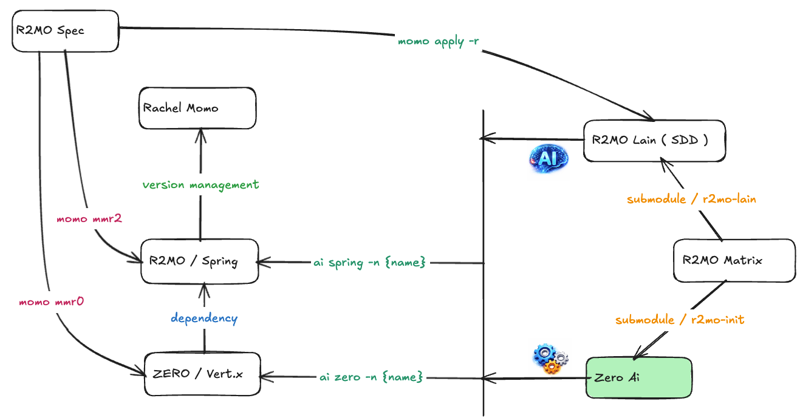

# Zero工具箱


> For [Rachel Momo](https://www.weibo.com/maoxiaotong0216)


## 0. 引导

- 教程：<https://www.yuque.com/jiezizhu/r2mo>
- 教程地图：<https://kumu.io/LangYu1017/zero>
- 示例：<https://gitee.com/zero-ws/zero-rachel-momo>



---

## 1. 安装流程

> Windows必须启用 WSL 才可用

使用以下命令安装该工具

```
npm install -g zero-ai
```

等你看到下边的输出信息后，证明安装过程已完成：

```
/usr/local/bin/ai -> /usr/local/lib/node_modules/vertx-ai/src/ai.js
+ zero-ai@x.x.xx
added 77 packages from 119 contributors in 8.417s
```

版本跟随 `R2MO / MOMO` 版本同步更新，所以最新版是 `1.0.48`

## 2. 常用命令说明

```bash
# 常用命令可直接查看帮助信息
ai help

# 初始化 R2MO Spring 工程脚手架
ai spring -name app-fly
ai spring -n app-fly

# 初始化 ZERO Vertx 工程脚手架
ai zero -name app-wait
ai zero -n app-wait
```


